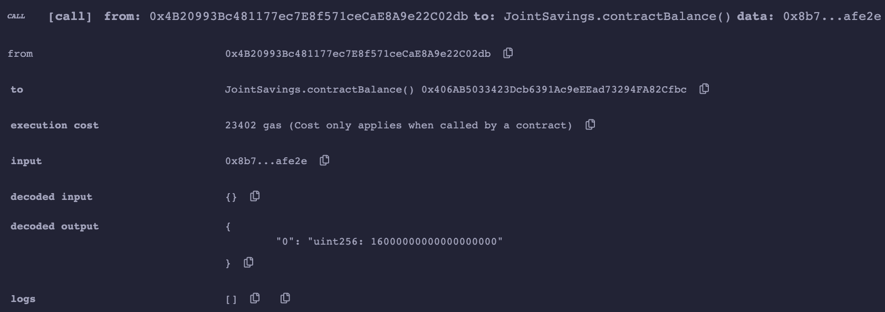

# Solidity Joint Savings

`joint_savings.sol` shows a simple joint savings contract that allows two addresses to withdraw ether from the contract balance. Ether can be deposited to the contract by anyone. The two owner accounts can currently be set any address, and is a future point of improvement.

## Example flow
The following interactions were performed via the Remix VM.

1. setAccounts

2. Deposit 1, 10, 5 Ether, and contract balance

3. Withdraw to account 1

4. Withdraw to account 2

